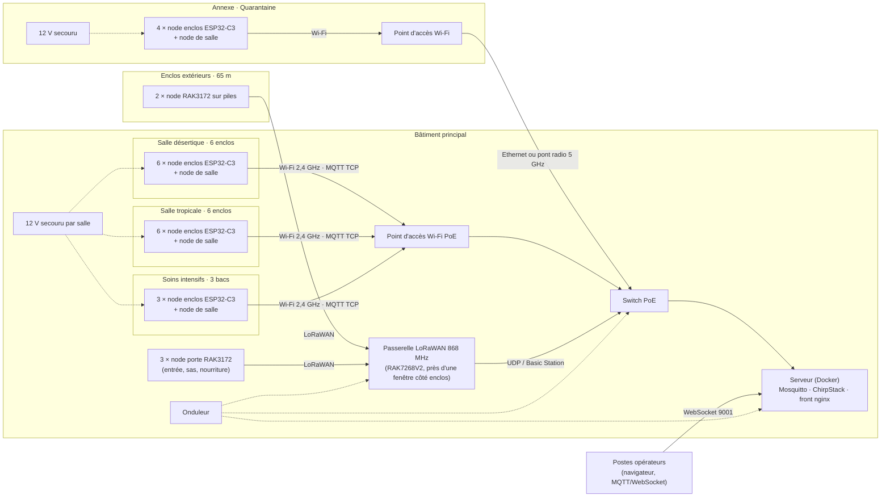

# Partie A — Conception matérielle

## 0. Contraintes qui pilotent les choix

| Contrainte (énoncé) | Conséquence technique |
|---|---|
| Températures 5–55 °C à ±0,5 °C | Sonde numérique calibrée d'usine ; pas de thermistance sans étalonnage. |
| Lumière 0–100 000 lx | Le capteur doit dépasser 100 klx sans saturer (lampes à 45 klx, soleil en extérieur jusqu'à 85 klx). |
| Porte visible sur le front en moins de 2 s | Détection par **interruption** et émission immédiate, pas d'attente de la période de mesure. |
| Extérieur : 6 mois sans intervention, sans secteur | Radio basse consommation, sommeil profond, piles primaires. |
| ≤ 30 € par enclos intérieur, hors infrastructure | Modules grand public, un seul microcontrôleur par enclos. |
| Coupure réseau < 10 min sans perte d'alerte critique | Tampon dans les nodes, QoS 1 et persistance broker (partie B), infrastructure réseau secourue. |
| QUA : 42 m, deux murs béton de 30 cm | Wi-Fi direct trop faible : le simulateur donne −84 dBm, soit environ 25 dB d'atténuation pour les deux murs à 2,4 GHz. |
| EXT : 65 m, extérieur | Le simulateur donne −110 dBm en Wi-Fi : impossible. Il faut une radio longue portée (sensibilité −123 à −137 dBm). |
| TRO : humidité jusqu'à 85 % | Sondes étanches (gaine inox), électronique hors du terrarium, vernis de tropicalisation. |

Notation des matrices : chaque candidat reçoit une note de 1 (mauvais) à 5 (excellent) par critère ; total = Σ(note × poids), sur 500.

## 1. Matrices de décision

### 1.1 Microcontrôleur — nodes alimentés (enclos intérieurs, salles)

| Critère (poids) | ESP32-C3 | ESP32 (WROOM) | RP2040 Pico W | STM32WL (RAK3172) |
|---|---|---|---|---|
| Wi-Fi intégré (25) | 5 | 5 | 4 | 1 |
| Coût (20) | 5 (≈ 2,5 €) | 4 | 3 | 3 |
| Écosystème : OneWire, I²C, MQTT, OTA (20) | 5 | 5 | 4 | 3 |
| Consommation (10) | 3 | 2 | 3 | 5 |
| Périphériques : ADC, I²C, interruptions (10) | 4 | 5 | 4 | 3 |
| Sécurité : secure boot, chiffrement flash, TLS (15) | 5 | 4 | 2 | 4 |
| **Total** | **470** | 435 | 340 | 285 |

**Choix : ESP32-C3.** Il a le Wi-Fi et le TLS natifs, ainsi que le secure boot. C'est un RISC-V à faible coût. Ses broches couvrent largement le besoin : un bus 1-Wire, l'I²C, une interruption de porte et deux sorties relais.

### 1.2 Microcontrôleur — nodes sur pile (enclos extérieurs, portes du bâtiment)

| Critère (poids) | RAK3172 (STM32WL) | CubeCell (ASR6502) | nRF52840 + SX1262 | ESP32-C3 + SX1276 |
|---|---|---|---|---|
| Consommation en veille (35) | 5 (1,7 µA) | 5 | 4 | 2 |
| Radio LoRa intégrée (25) | 5 | 5 | 3 | 3 |
| Écosystème / pile LoRaWAN certifiée (15) | 4 | 2 | 4 | 5 |
| Sécurité (15) | 4 | 3 | 4 | 4 |
| Coût (10) | 3 | 4 | 2 | 4 |
| **Total** | **450** | 415 | 355 | 320 |

**Choix : RAK3172.** Le microcontrôleur et la radio LoRa sont dans la même puce (STM32WLE5), avec une pile LoRaWAN fournie et une veille à 1,7 µA. Le module se programme sous Arduino ou STM32Cube.

### 1.3 Sonde de température

| Critère (poids) | DS18B20 gaine inox | SHT31 / SHT40 en sonde | NTC 10 kΩ + ADC | PT100 + MAX31865 |
|---|---|---|---|---|
| Précision sur 5–55 °C (25) | 4 (±0,5 °C de −10 à 85 °C) | 5 (±0,2 °C) | 2 (ADC ESP32 non linéaire) | 5 |
| Tenue à l'humidité et à la chaleur (20) | 5 | 3 (condensation à 85 % HR) | 4 | 5 |
| Coût (15) | 5 | 3 | 5 | 1 |
| Plusieurs sondes sur un câblage simple (15) | 5 (bus 1-Wire) | 3 | 3 | 2 |
| Diagnostic de panne (10) | 5 (CRC, codes −127 / 85) | 4 | 2 | 4 |
| Qualité d'approvisionnement (15) | 3 (nombreux clones) | 4 | 4 | 4 |
| **Total** | **445** | 375 | 330 | 370 |

**Choix : DS18B20 en gaine inox étanche.** Ses deux codes d'erreur (−127 et 85) sont exploités par le front. Il faut l'acheter chez un distributeur officiel pour éviter les clones hors tolérance. Option : un SHT40 pour l'ambiance de la salle tropicale, qui mesurerait aussi l'humidité.

### 1.4 Capteur de lumière

| Critère (poids) | VEML7700 | BH1750 | TSL2591 | Photorésistance (LDR) |
|---|---|---|---|---|
| Plage 0–100 klx (30) | 5 (jusqu'à 120 klx) | 2 (65 klx sans réglage) | 3 (88 klx) | 3 (non calibrée) |
| Précision, réponse spectrale (20) | 4 | 4 | 5 | 1 |
| Coût (20) | 4 | 5 | 2 | 5 |
| Interface (15) | 5 (I²C) | 5 | 5 | 3 (ADC) |
| Consommation (15) | 5 (0,5 µA à l'arrêt) | 4 | 4 | 3 |
| **Total** | **460** | 375 | 365 | 300 |

**Choix : VEML7700.** C'est le seul candidat bon marché qui couvre les 100 klx demandés. Il est placé derrière un diffuseur pour ne pas chauffer sous la lampe.

### 1.5 Contact de porte

| Critère (poids) | Reed MC-38 | Effet Hall (DRV5032) | Microrupteur | Barrière infrarouge |
|---|---|---|---|---|
| Fiabilité, absence d'usure (25) | 4 | 5 | 2 | 3 |
| Consommation (25) | 5 (contact sec) | 4 (≈ 1 µA en continu) | 5 | 1 |
| Coût (15) | 5 | 4 | 5 | 3 |
| Pose sur porte vitrée ou coulissante (20) | 5 (adhésif) | 3 | 2 | 2 |
| Compatible interruption et réveil (15) | 5 | 5 | 5 | 4 |
| **Total** | **475** | 420 | 365 | 245 |

**Choix : contact reed MC-38**, câblé vers GND avec un pull-up (interne sur l'ESP32, 1 MΩ externe sur les nodes à pile). Il sert de source d'interruption sur front montant et descendant, et réveille les nodes à pile.

### 1.6 Connectivité par zone

Critères : portée et pénétration (25), latence < 2 s et commandes descendantes (25), coût d'infrastructure (15), consommation (10), intégration IP/MQTT (25).

| Zone | Wi-Fi direct | Wi-Fi + point d'accès local | LoRaWAN | Zigbee / Thread | Filaire (Ethernet / RS-485) | **Choix** |
|---|---|---|---|---|---|---|
| DES, TRO, SOI (9–18 m, placo) | **470** | — | 320 | 335 | 420 | **Wi-Fi** |
| QUA (42 m, béton) | 370 (portée 1/5) | **440** | 360 | 310 | 420 | **Wi-Fi via un AP dans l'annexe** |

Pour la quarantaine, un point d'accès dans l'annexe garde **le même node et le même firmware** que les autres salles. Ses commandes sont immédiates. Il est relié au bâtiment principal par Ethernet, ou par un pont radio extérieur 5 GHz si aucun câble n'existe.

Pour les nodes sur pile, les poids changent : portée 25, consommation 30, latence 10, coût 15, intégration 20.

| Zone | Wi-Fi | LoRaWAN | Zigbee | NB-IoT / LTE-M | **Choix** |
|---|---|---|---|---|---|
| EXT (65 m, extérieur) et portes du bâtiment | 280 | **420** | 330 | 345 | **LoRaWAN (868 MHz)** |

Avec LoRaWAN, une ouverture de porte part immédiatement en émission montante : environ 60 ms de temps d'antenne en SF7. Le délai reste donc bien sous 2 s. Une seule passerelle couvre l'extérieur et les trois portes. Le serveur réseau (ChirpStack) traduit les trames binaires en messages MQTT v1, sur la même arborescence de topics que les nodes Wi-Fi.

### 1.7 Alimentation

Nodes alimentés. Critères : sécurité électrique (25), coût (20), fiabilité (20), installation (20), continuité pendant une coupure secteur (15).

| | Bloc USB 5 V par node | AC/DC 230 V intégré (HLK-PM01) | PoE | **12 V centralisé par salle, secouru, + convertisseur 5 V par node** |
|---|---|---|---|---|
| Total | 400 | 285 | 380 | **420** |

**Choix : alimentation 12 V par salle, secourue par batterie.** C'est l'enseignement de la partie F : pendant la coupure de la quarantaine, les nodes se sont éteints exactement au moment où la température chutait. Une alimentation secourue garde la supervision active. La source et la batterie font partie de l'infrastructure (hors budget par enclos). Chaque node n'embarque qu'un convertisseur MP1584 à 0,80 €. Il n'y a pas de 230 V dans un boîtier exposé à 85 % d'humidité.

Nodes sur pile. Critères : autonomie ≥ 6 mois (30), tenue au froid (20), maintenance (20), coût (15), simplicité et sécurité (15).

| | **2 × AA lithium Li-FeS2 (Energizer L91)** | 18650 + panneau solaire | LiSOCl₂ ER14505 | 3 × AA alcalines |
|---|---|---|---|---|
| Total | **485** | 360 | 415 | 410 |

Ces piles se trouvent partout et fonctionnent jusqu'à −40 °C. Elles s'autodéchargent de moins de 1 % par an et alimentent directement le STM32WL (1,8 à 3,6 V), sans régulateur.

## 2. Nomenclature (BOM)

Prix unitaires TTC relevés pour de petites quantités, **indicatifs** : ils doivent être vérifiés et datés le jour du rendu. Fournisseurs : AliExpress et LCSC pour les modules, Mouser et Farnell pour les composants d'origine.

### 2.1 Node d'enclos intérieur (19 exemplaires : DES, TRO, SOI, QUA)

| Composant | Réf. | Qté | Prix unit. | Total | Source |
|---|---|---|---|---|---|
| Microcontrôleur Wi-Fi | ESP32-C3 SuperMini | 1 | 2,50 € | 2,50 € | AliExpress / LCSC |
| Sonde point chaud et point froid | DS18B20 gaine inox, 1 m | 2 | 2,50 € | 5,00 € | Mouser / AliExpress (puce Analog Devices) |
| Capteur de lumière | Module VEML7700 | 1 | 2,50 € | 2,50 € | AliExpress (Adafruit 4162 ≈ 5 €) |
| Contact de porte | Reed MC-38 | 1 | 1,00 € | 1,00 € | AliExpress |
| Relais lampe et éclairage | Module 2 relais 5 V | 1 | 2,50 € | 2,50 € | AliExpress |
| Conversion 12 V → 5 V | MP1584 | 1 | 0,80 € | 0,80 € | AliExpress |
| Boîtier IP54, bornier, 4,7 kΩ, câbles | — | 1 | 4,00 € | 4,00 € | — |
| **Total node** | | | | **18,30 €** | marge de 39 % sous les 30 € |

Avec des composants d'origine (VEML7700 Adafruit, DS18B20 Mouser), le node revient à environ 24 €, toujours sous le budget.

### 2.2 Node de salle (4 exemplaires : ambiance et porte de salle)

ESP32-C3 (2,50) + DS18B20 (2,50) + reed (1,00) + MP1584 (0,80) + boîtier (3,00) = **9,80 €**.

### 2.3 Node extérieur (2 exemplaires : EXT-01, EXT-02)

| Composant | Réf. | Qté | Prix unit. | Total |
|---|---|---|---|---|
| Microcontrôleur et radio LoRa | RAK3172 | 1 | 8,50 € | 8,50 € |
| Sondes | DS18B20 gaine inox | 2 | 2,50 € | 5,00 € |
| Lumière | VEML7700 | 1 | 2,50 € | 2,50 € |
| Porte | Reed MC-38 + pull-up 1 MΩ | 1 | 1,10 € | 1,10 € |
| Piles | Energizer L91 AA | 2 | 2,00 € | 4,00 € |
| Antenne 868 MHz, boîtier IP65, presse-étoupes | — | 1 | 9,00 € | 9,00 € |
| **Total** | | | | **30,10 €** |

### 2.4 Node de porte du bâtiment (3 exemplaires)

RAK3172 (8,50) + reed (1,10) + 2 × L91 (4,00) + boîtier (4,00) = **17,60 €**.

### 2.5 Infrastructure

| Élément | Qté | Prix unit. | Total |
|---|---|---|---|
| Passerelle LoRaWAN 8 canaux (RAK7268V2) | 1 | 200 € | 200 € |
| Point d'accès Wi-Fi PoE (bâtiment principal + annexe) | 2 | 60 € | 120 € |
| Switch PoE 8 ports | 1 | 60 € | 60 € |
| Serveur : mini-PC ou Raspberry Pi 5 + SSD | 1 | 150 € | 150 € |
| Onduleur (serveur, switch, passerelle) | 1 | 90 € | 90 € |
| Alimentation 12 V secourue par salle (bloc + batterie 7 Ah) | 4 | 45 € | 180 € |
| **Total infrastructure** | | | **800 €** |

### 2.6 Site complet

| Type de node | Qté | Unitaire | Total |
|---|---|---|---|
| Enclos intérieur | 19 | 18,30 € | 347,70 € |
| Salle | 4 | 9,80 € | 39,20 € |
| Enclos extérieur | 2 | 30,10 € | 60,20 € |
| Porte du bâtiment | 3 | 17,60 € | 52,80 € |
| **Nodes** | 28 | | **499,90 €** |
| Infrastructure | | | 800,00 € |
| **Site** | | | **≈ 1 300 €** |

## 3. Node d'enclos intérieur sous Wokwi

Fichiers : `hardware/wokwi-node-interieur/` (`diagram.json`, `sketch.ino`, `libraries.txt`).
Lien du projet : **à compléter** après l'import dans Wokwi (wokwi.com → New project → ESP32-C3, puis coller les trois fichiers).

| Fonction | Broche ESP32-C3 | Composant Wokwi | Composant réel |
|---|---|---|---|
| Bus 1-Wire, 2 sondes | GPIO 4 (pull-up 4,7 kΩ) | 2 × `board-ds18b20` | 2 × DS18B20 |
| Lumière | GPIO 1 (ADC) | `wokwi-photoresistor-sensor` | VEML7700 en I²C (absent du catalogue Wokwi) |
| Porte | GPIO 5, `INPUT_PULLUP`, **interruption CHANGE** | `wokwi-slide-switch` | Reed MC-38 |
| Relais lampe | GPIO 6 | LED | Module relais |

Vérification : le firmware compile et tourne dans Wokwi (capture `hardware/wokwi-node-interieur/simulation.png`).
Les deux sondes sont lues, la porte est remontée par interruption, et les messages v1 partent sur un broker MQTT de test.

Piège rencontré : avec deux DS18B20 sur le même bus, `getTempCByIndex(0)` renvoyait la sonde **froide**.
L'index suit l'ordre de recherche des adresses ROM, pas le câblage. Le firmware associe donc chaque sonde à son
rôle par son **numéro de série**, relevé à l'installation (`HOT_SERIAL`, `COLD_SERIAL`). Une sonde absente
publie −127, ce qui déclenche l'alerte « sonde déconnectée ».

Fonctionnement : l'interruption lève un drapeau. La boucle publie l'état de la porte après 30 ms d'anti-rebond, donc en moins de 100 ms. Les DS18B20 convertissent en mode non bloquant (750 ms), pour que la boucle reste réactive pendant la conversion. Les mesures partent toutes les 30 s, le heartbeat toutes les 5 min. Le node utilise un Last Will retenu, republie l'état de sa porte à chaque reconnexion et traite la commande `lamp` avec acquittement.

## 4. Node extérieur basse consommation

### 4.1 Stratégie de veille

- Le STM32WL est en mode Stop 2 avec la RTC active (1,7 µA pour le module complet).
- Il a **deux sources de réveil** : le timer RTC toutes les 300 s pour les mesures, et l'interruption du reed pour la porte, qui part immédiatement.
- Les DS18B20 et le VEML7700 sont alimentés en permanence, car leur veille est négligeable. Le VEML7700 est remis en arrêt après chaque mesure.
- Une seule trame montante par cycle regroupe les deux températures, la lumière et la tension de la pile, en 10 octets binaires. Il n'y a pas de heartbeat séparé : chaque trame en tient lieu. Le serveur réseau la traduit en messages v1.
- L'ADR (débit adaptatif) choisit le plus petit facteur d'étalement possible, SF7 à 65 m, ce qui réduit le temps d'antenne.
- Le pull-up du reed vaut 1 MΩ : 3,3 µA quand la porte est fermée (contact fermé), 0 quand elle est ouverte.

### 4.2 Calcul d'autonomie

Hypothèses défavorables : SF9 (temps d'antenne 205 ms pour une charge utile de 23 octets), émission à 14 dBm comptée à 45 mA (le datasheet donne environ 25 mA ; marge ×1,8).

| Poste | Courant | Durée par cycle | Charge par cycle |
|---|---|---|---|
| Réveil, MCU actif + conversion des 2 DS18B20 | 4 mA + 2 × 1,5 mA | 0,8 s | 5,6 mA·s |
| Mesure VEML7700 | 45 µA | 0,1 s | ≈ 0 |
| Émission LoRa SF9 | 45 mA | 0,205 s | 9,2 mA·s |
| Fenêtres de réception RX1 + RX2 | 6 mA | 2 × 0,05 s | 0,6 mA·s |
| **Total par cycle de 300 s** | | | **15,4 mA·s** |

- Mesures : 288 cycles par jour × 15,4 mA·s = 4 435 mA·s, soit **1,23 mAh par jour**.
- Portes : environ 10 événements par jour × 9,8 mA·s, soit 0,03 mAh par jour.
- Veille : (1,7 + 2 × 1,0 + 0,5 + 3,3) µA = 7,5 µA × 24 h, soit **0,18 mAh par jour**.
- **Total : 1,44 mAh par jour.** Six mois (183 jours) consomment **264 mAh**.

Capacité utile : 2 × AA L91 en série donnent 3 000 mAh, ramenés à 2 400 mAh (−20 % pour le froid hivernal et le vieillissement). La tension reste au-dessus de 1,8 V jusqu'en fin de vie.

**Autonomie estimée : 2 400 / 1,44 ≈ 1 650 jours, soit environ 4,5 ans, ou 9 fois l'exigence de 6 mois.**

Cas extrême en SF12, si la passerelle était mal placée : 1 319 ms d'antenne, 66 mA·s par cycle, soit 5,4 mAh par jour. Il faut alors 990 mAh pour 6 mois, ce qui laisse encore une marge de 2,4. **L'exigence de 6 mois est tenue même dans le pire cas radio.**

Le simulateur décharge ses piles beaucoup plus vite (environ 3,5 % par jour), pour que les alertes de pile soient visibles pendant une démonstration.

## 5. Architecture du site

Flux : les nodes Wi-Fi publient directement en MQTT sur Mosquitto (1883). ChirpStack décode les trames LoRaWAN et les republie sur la **même arborescence** `rc/v1/…` : c'est la « passerelle » de la partie B, dont l'horloge fait foi. Le front statique est servi par nginx et se connecte en MQTT over WebSocket (9001). Le serveur, le switch et la passerelle LoRa sont sur onduleur. Une coupure secteur générale de moins de 10 min ne coupe donc ni le réseau ni la supervision, et les salles restent alimentées par leur 12 V secouru.
